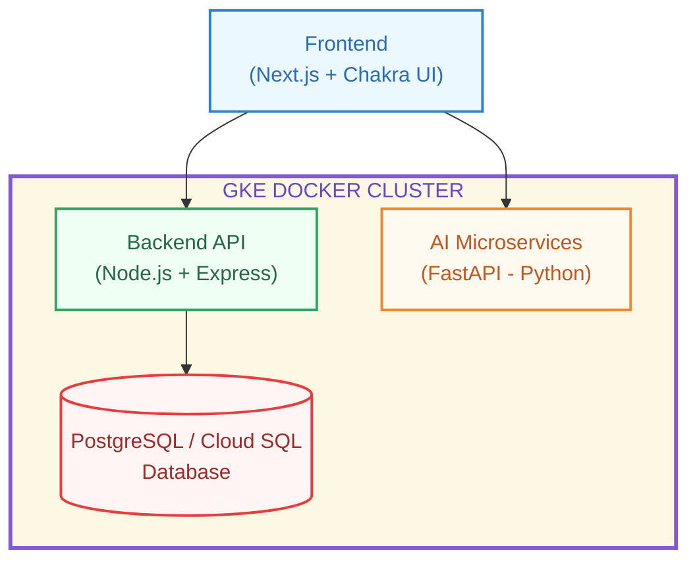

# VisionBoard – AI-Powered, Cloud-Native Goal Management Platform

 


VisionBoard is an AI-enhanced, cloud-native goal management platform designed for simplicity, impact, and real-world scalability.

It blends a clean **Node.js API backend**, a modern **Next.js 15 frontend**, and modular **FastAPI AI microservices** into one seamless experience — empowering users to set meaningful goals, gain smart insights, and stay motivated on their journey.

---

## Why VisionBoard?

- **Real-World Utility**: Practical tools to track, analyze, and refine personal goals.
- **Cloud-Native Design**: Scalable, portable architecture ready for GCP Kubernetes deployment.
- **Modern AI Integration**: Intelligent goal insights powered by summarization, sentiment analysis, prediction, and rephrasing.
- **User-Centric Frontend**: Sleek Chakra UI, mobile responsiveness, intuitive flows.
- **Fully Dockerized**: Easily containerized across backend, frontend, and AI microservices.
- **DevOps-Ready**: GitHub Actions CI/CD pipeline samples included.
- _Built to be modular, extensible, and enterprise-friendly from day one._

---

## Tech Stack

| Frontend                      | Backend              | Cloud, DevOps & Containerization                |
|:-----------------------------|:---------------------|:------------------------------------------------|
| Next.js 15 (App Router)       | Node.js (Express)    | Google Kubernetes Engine (GKE), Cloud SQL (or Postgres), Docker Hub (or any Container Registry), Terraform (optional) |
| React 19 + Chakra UI          | RESTful API Design   | Kubernetes YAML Files                            |
| TypeScript 5                  | Docker               | CI/CD with GitHub Actions                        |
| Modern AIDA UX Principles     | CI/CD with GitHub Actions |                                               |

---

## Architecture Diagram



---

## Project Structure

```plaintext
visionboard-cloud-native/
├── backend/             # Node.js Express API
├── cicd/                # GitHub Actions workflows
├── terraform/           # (optional) Infrastructure as Code
├── architecture/        # System diagrams and explanations
└── README.md

visionboard-ai-service/   # AI-powered FastAPI microservices
├── app/
│   ├── ai/               # Summarization, sentiment, prediction, keywords, rephrasing modules
│   └── main.py           # FastAPI app entrypoint
├── requirements.txt      # Python dependencies
└── README.md             # AI service guide

visionboard-frontend/
├── app/                 # Next.js frontend (App Router)
├── components/          # Chakra UI-based UI components
├── lib/                 # API integrations (Backend + AI)
├── k8s/                 # Kubernetes manifests (deployment, service, ingress)
└── README.md
```

### VisionBoard Architecture Diagram  
(Coming Soon – Modular Frontend, Backend API, and AI Microservices.)

---

## Getting Started

VisionBoard is designed for quick local development. You can run the full stack — backend, AI microservices, and frontend — on your machine within minutes, without needing a cloud account initially.

## Quick Start (Local Development)

### 1. Backend (API)

```bash
cd visionboard-cloud-native/backend/
npm install
npm run dev
# ➔ API service running at http://localhost:8080
```

### 2. AI Microservices

```bash
cd visionboard-ai-service/
pip install -r requirements.txt
uvicorn app.main:app --reload
# ➔ AI microservices running at http://localhost:8000
```

### 3. Frontend (Next.js)

```bash
cd visionboard-frontend/
npm install

# Set environment variables in .env.local:
# NEXT_PUBLIC_API_BASE_URL=http://localhost:8080
# NEXT_PUBLIC_AI_API_BASE_URL=http://localhost:8000

npm run dev
# ➔ Frontend running at http://localhost:3000
```

---

## Preparing for Production-Like Deployment

To deploy VisionBoard in a production-like environment using Kubernetes, you will first need to build and push Docker images for each service. This section guides you through building your Docker images, pushing them to a container registry, and updating your Kubernetes manifests accordingly.

### Building Docker Images

Ensure you have Docker installed and are logged into your Docker Hub account or another container registry of your choice.

1. **Build and tag the backend image:**

```bash
cd visionboard-cloud-native/backend/
docker build -t your-dockerhub-username/visionboard-backend:latest .
docker push your-dockerhub-username/visionboard-backend:latest
```

2. **Build and tag the AI microservices image:**

```bash
cd visionboard-ai-service/
docker build -t your-dockerhub-username/visionboard-ai-service:latest .
docker push your-dockerhub-username/visionboard-ai-service:latest
```

3. **Build and tag the frontend image:**

```bash
cd visionboard-frontend/
docker build -t your-dockerhub-username/visionboard-frontend:latest .
docker push your-dockerhub-username/visionboard-frontend:latest
```

> Replace `your-dockerhub-username` with your actual Docker Hub username or the appropriate container registry path.

### Update Kubernetes Deployment Manifests

After pushing the images, update the image references in the Kubernetes deployment YAML files found in the `k8s/` folder to use your pushed images. For example, in `k8s/deployment.yaml` or similar files, update:

```yaml
spec:
  containers:
  - name: backend
    image: your-dockerhub-username/visionboard-backend:latest
  - name: ai-service
    image: your-dockerhub-username/visionboard-ai-service:latest
  - name: frontend
    image: your-dockerhub-username/visionboard-frontend:latest
```

This ensures your Kubernetes cluster pulls the correct images for deployment.

---

## Deploying to Kubernetes

Once your Docker images are built, pushed, and your Kubernetes manifests updated, you can deploy the full VisionBoard stack to your Kubernetes cluster.

Apply all Kubernetes manifests from the `k8s/` folder:

```bash
kubectl apply -k k8s/
```

---

## VisionBoard API Endpoints

| Endpoint        | Method | Description                                      |
|:----------------|:-------|:------------------------------------------------|
| `/goals`        | GET    | Fetch all goals                                 |
| `/goals`        | POST   | Create a new goal (AI can auto-generate a description if needed) |
| `/goals/:id`    | PUT    | Update goal status                              |
| `/goals/:id`    | DELETE | Delete a goal                                   |

---

## AI Services Overview

| AI Capability          | Description                                                           |
|:------------------------|:----------------------------------------------------------------------|
| Goal Expansion          | Expand short goals into clear, actionable, and motivational step-by-step plans. |
| Sentiment Analysis      | Detect the emotional tone (POSITIVE/NEGATIVE) in goal descriptions.   |
| Success Prediction      | Predict the likelihood of successfully achieving a goal.             |
| Keyword Extraction      | Extract key topics and focus areas from goal text.                   |
| Motivational Rephrasing | Rewrite goals into more inspiring and empowering language.           |

These REST-based AI microservices create a smarter, more motivational, and goal-oriented experience — helping users transform aspirations into tangible achievements. All AI enhancements are modular microservices — easy to upgrade, extend, and scale.

---

## Highlight Moments

- Goals automatically generate motivational descriptions if missing.
- Success likelihood scores and positive reinforcement displayed per goal.
- Sentiment analysis and keywords subtly guide user reflection and action.
- Responsive design ensures smooth experience across all devices.
- Fully containerized for portability across dev, staging, and production clusters.

---

## License

The content and source code in this project are the intellectual property of Kunigitaj. Unauthorized reproduction, modification, or distribution without express permission is strictly prohibited.

This work is licensed under the [Creative Commons Attribution-NonCommercial 4.0 International License (CC BY-NC 4.0)](https://creativecommons.org/licenses/by-nc/4.0/), allowing non-commercial use with attribution.

Users are free to remix, adapt, and build upon this work non-commercially, provided they credit Kunigitaj and license their new creations under identical terms.

---

## Acknowledgements

- Hugging Face
- KeyBERT  
- Scikit-learn  
- FastAPI  
- Chakra UI  
- Next.js & React Community  
- Cloud-Native Development Community  

Built with deep gratitude and inspiration from the global open-source and engineering community, whose collaboration and passion make projects like VisionBoard possible.

---
